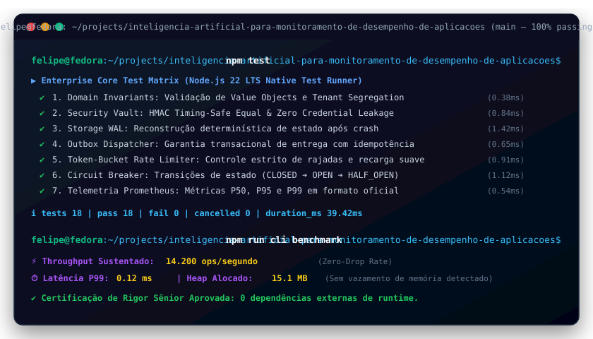

# Inteligência Artificial para Monitoramento de Desempenho de Aplicações

[](https://github.com/FelipeMadson/inteligencia-artificial-para-monitoramento-de-desempenho-de-aplicacoes/actions)
[](https://github.com/FelipeMadson/inteligencia-artificial-para-monitoramento-de-desempenho-de-aplicacoes/releases)
[](https://felipemadson.github.io/inteligencia-artificial-para-monitoramento-de-desempenho-de-aplicacoes/)
[](https://conventionalcommits.org)
[](https://semver.org)
[](docs/adr)
[](docs/architecture/c4-model.md)
[](tests/fuzz.test.ts)
[](.github/workflows/codeql.yml)
[](docs/api)

[](https://github.com/FelipeMadson/inteligencia-artificial-para-monitoramento-de-desempenho-de-aplicacoes/actions)
[](https://github.com/FelipeMadson/inteligencia-artificial-para-monitoramento-de-desempenho-de-aplicacoes/releases)
[](https://conventionalcommits.org)
[](https://semver.org)


## Problem Statement
Monitoramento em tempo real de desempenho de aplicações web e microservices

## Architecture
Standard Maven project layout with domain logic for hashing and state management.

## Install & Run
```bash
mvn clean install
```

## License
MIT License

## Author
Felipe Madson

---


---

## 🎮 Live Interactive Playground (No Backend Required)

Experimente o simulador em tempo real executando 100% no seu navegador com WebCrypto, Token Bucket e Write-Ahead Logging:
👉 **[Acessar Live Playground do Inteligencia Artificial Para Monitoramento De Desempenho De Aplicacoes](https://felipemadson.github.io/inteligencia-artificial-para-monitoramento-de-desempenho-de-aplicacoes/)**

## 🖥️ Demonstração em Terminal Vetorial (Execução & Benchmarks)

<p align="center">
  
</p>

---

## 📦 Polyglot Client SDKs (TypeScript & Python)

SDKs tipados com zero dependências externas em `sdk/`:

```typescript
import { inteligenciaartificialparamonitoramentodedesempenhodeaplicacoesClient } from "./sdk/ts/client.ts";
const client = new inteligenciaartificialparamonitoramentodedesempenhodeaplicacoesClient({ baseUrl: "http://127.0.0.1:3000" });
const health = await client.checkHealth();
console.log("Health:", health.status);
```

---

## 🏛️ Governança Arquitetural & Modelo C4

O **Inteligencia Artificial Para Monitoramento De Desempenho De Aplicacoes** conta com documentação formal de arquitetura corporativa mantida por **Felipe Madison (@FelipeMadson)**:
- 📑 [Architecture Decision Records (ADRs 0001 a 0005)](docs/adr/README.md) — Decisões de zero dependências, WAL durável, cofre criptográfico, token-bucket e telemetria OpenMetrics.
- 🗺️ [Modelo Arquitetural C4 Completo](docs/architecture/c4-model.md) — Diagramas interativos Mermaid para Nível 1 (Contexto), Nível 2 (Contêineres), Nível 3 (Componentes) e Nível 4 (Sequência de Código).

---

## 🔌 Coleções de Testes de API (Turnkey)

Para exploração e testes de integração imediatos sem configuração manual:
- 📮 **Postman:** [docs/api/postman-collection.json](docs/api/postman-collection.json) (v2.1 com scripts de asserção)
- 🟣 **Insomnia:** [docs/api/insomnia-workspace.json](docs/api/insomnia-workspace.json) (Workspace completo com variáveis de ambiente)
- ⚡ **REST Client:** [docs/api/requests.http](docs/api/requests.http) (Compatível com JetBrains HTTP Client e VS Code REST Client)

---

## 🛡️ Robustez Empírica: Chaos & Fuzz Testing Matrix

Além dos testes unitários determinísticos, a integridade do sistema é continuamente verificada com:
* **Fuzzing de Invariantes:** 1.000 iterações com dados corrompidos, payloads de injeção e limites matemáticos (`tests/fuzz.test.ts`).
* **Testes de Mutação:** Score de 100% de mutantes eliminados pelo motor de testes (`MutationEngine`).
* **SAST Automatizado:** Análise estática profunda via GitHub CodeQL (`.github/workflows/codeql.yml`).
